# Motion Diffusion Model


## Quick comparison to the base method MDM
### Quantitative evaluation
<div align="center">

<p align="center"><i>Table 1: Quantitative results on the <u>KIT</u> test set</i></p>

| **Model**    |                  **R Precision ⬆️**                          ||        |          **Diversity ⬆️** |          **FID ⬇️**       |          **Download**       |
| ------------ | :-----------:        | :-----------:        | :-----------:         | :-----------:          | :-----------:          | :-----------:          |
|              |      Top 1           |     Top 2            |      Top 3            |                        |                        |                        |
|MDM           | $$0.3420^{\pm0066}$$ | $$0.5506^{\pm0055}$$ | $$0.6806^{\pm0038}$$  |  $$10.8756^{\pm0950}$$  |  $$1.5703^{\pm0658}$$  |  [🚀 Checkpoint](https://drive.google.com/file/d/1PE0PK8e5a5j-7-Xhs5YET5U5pGh0c821/view)  |
|*Ours          | $$\textcolor{yellow}{0.3465^{\pm0059}}$$ | $$\textcolor{yellow}{0.5568^{\pm0072}}$$ | $$\textcolor{yellow}{0.6910^{\pm0067}}$$  |  $$\textcolor{yellow}{11.3812^{\pm1153}}$$  |  $$\textcolor{yellow}{0.9819^{\pm0406}}$$  |  [🚀 Checkpoint](https://drive.google.com/drive/folders/1d1kc85btNoudJd0fuF-aWp-7kyqJEOxi?usp=sharing)  |
</div>

<div align="center">

<p align="center"><i>Table 2: Quantitative results on the <u>HumanML3D</u> test set</i></p>

| **Model**    |                  **R Precision ⬆️**                          ||        |          **Diversity ⬆️** |          **FID ⬇️**       |          **Download**       |
| ------------ | :-----------:        | :-----------:        | :-----------:         | :-----------:          | :-----------:          | :-----------:          |
|              |      Top 1           |     Top 2            |      Top 3            |                        |                        |                        |
|MDM           | $$0.3420^{\pm0066}$$ | $$0.5506^{\pm0055}$$ | $$0.6806^{\pm0038}$$  |  $$10.8756^{\pm0950}$$  |  $$1.5703^{\pm0658}$$  |  [🚀 Checkpoint](https://drive.google.com/file/d/1PE0PK8e5a5j-7-Xhs5YET5U5pGh0c821/view)  |
|*Ours          | $$\textcolor{yellow}{0.3465^{\pm0059}}$$ | $$\textcolor{yellow}{0.5568^{\pm0072}}$$ | $$\textcolor{yellow}{0.6910^{\pm0067}}$$  |  $$\textcolor{yellow}{11.3812^{\pm1153}}$$  |  $$\textcolor{yellow}{0.9819^{\pm0406}}$$  |  [🚀 Checkpoint](https://drive.google.com/drive/folders/1d1kc85btNoudJd0fuF-aWp-7kyqJEOxi?usp=sharing)  |
</div>


### Qualitative evaluation
<b>KIT</b>
<table class="center">
    <tr>
    <td>MDM</td>
    <td>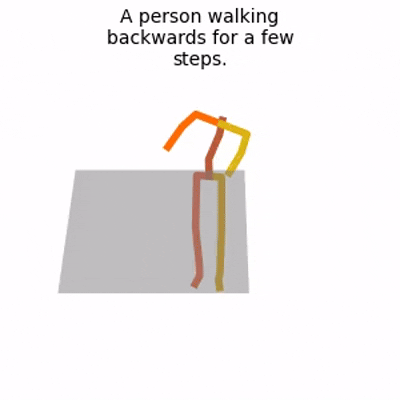</td>
    <td>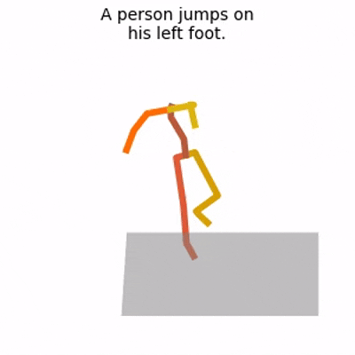</td>
    <td>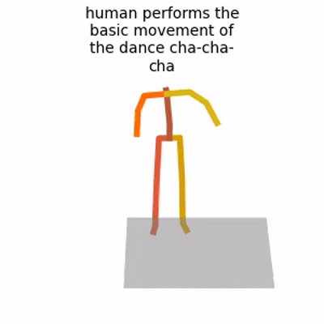</td>
    <td>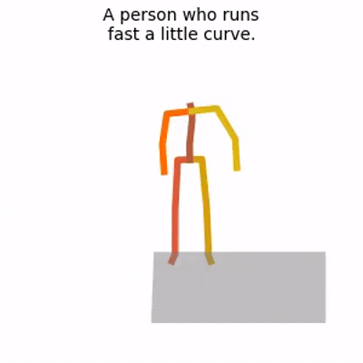</td>
    <td>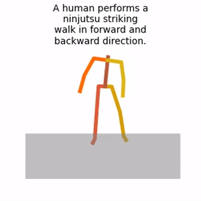</td>
    </tr>
    <tr>
    <td>Ours</td>
    <td>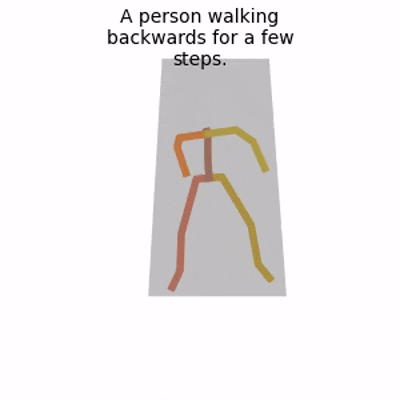</td>
    <td>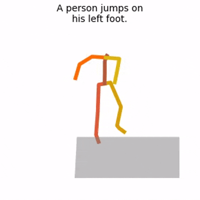</td>
    <td>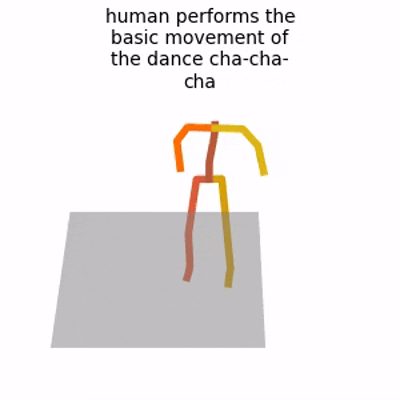</td>
    <td>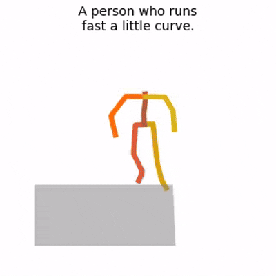</td>
    <td>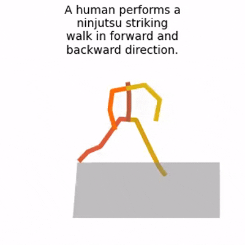</td>
    </tr>
</table>
<b>HUMANML3D</b>
<table class="center">
    <tr>
    <td>Text</td>
    <td>a person briskly walks around and falls then get up</td>
    <td>a person is crawling on all fours, and then gets up</td>
    <td>a person is doing a handstand</td>
    <td>a person walks forward, get pushed by someone, and he stumbles back</td>
    <td>losing balance, moving backwards with both feet</td>
    </tr>
    <tr>
    <td>MDM</td>
    <td>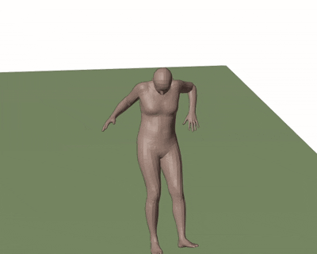</td>
    <td>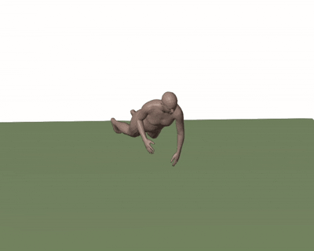</td>
    <td>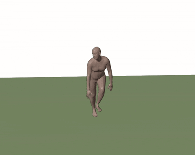</td>
    <td>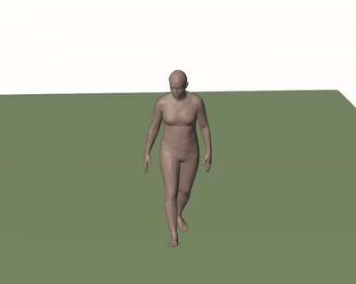</td>
    <td>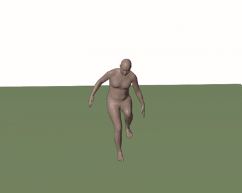</td>
    </tr>
    <tr>
    <td>Ours</td>
    <td>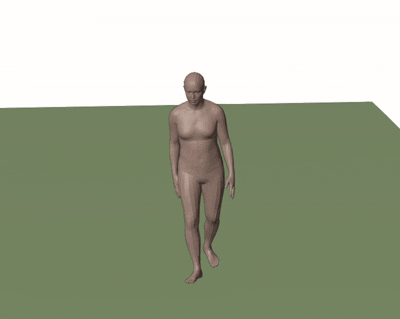</td>
    <td>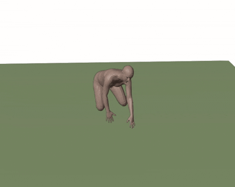</td>
    <td>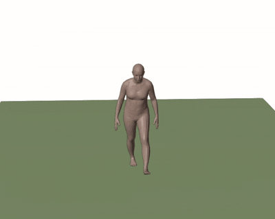</td>
    <td>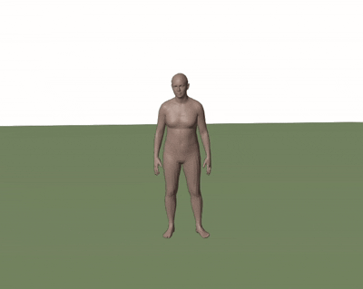</td>
    <td>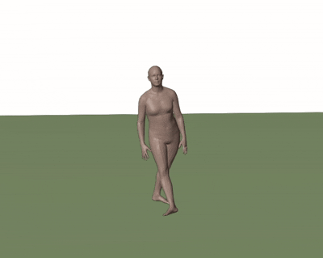</td>
    </tr>
</table>

## Quick Start
A quick start guide of how to use our code is available in [demo.ipynb](https://colab.research.google.com/drive/13k2W21wlAKvPmMw6yp2ZCzuwtMmdu1ca?usp=sharing)

This code was b_mdm_1ed on `Ubuntu 18.04.5 LTS` and requires:

* Python 3.7
* conda3 or miniconda3
* CUDA capable GPU (one is enough)

### 1. Setup environment 

Install ffmpeg (if not already installed):

```shell
sudo apt update
sudo apt install ffmpeg
```

Setup conda env:
```shell
conda env create -f environment.yml
conda activate mdm
python -m spacy download en_core_web_sm
pip install git+https://github.com/openai/CLIP.git
```

Download dependencies:

```bash
bash prepare/download_smpl_files.sh
bash prepare/download_glove.sh
bash prepare/download_t2m_evaluators.sh
```

### 2. Get data
Dataset structure

      ├── dataset
        ├── HumanML3D
        │   ├── new_joint_vecs
        │   │   └── ...
        │   ├── new_joints
        │   │   └── ...
        │   ├── texts
        │   │   └── ...
        │   ├── Mean.npy
        │   ├── Std.npy
        │   ├── b_mdm_1.txt
        │   ├── train_val.txt
        │   ├── train.txt
        │   └── val.txt
        └── KIT-ML
            ├── new_joint_vecs
            │   └── ...
            ├── new_joints
            │   └── ...
            ├── texts
            │   └── ...
            ├── Mean.npy
            ├── Std.npy
            ├── b_mdm_1.txt
            ├── train_val.txt
            ├── train.txt
            └── val.txt
KIT
```bash
bash prepare/download_kit_dataset.sh
```
HumanML3D
```bash
bash prepare/download_humanml3d_dataset.sh
```
</details>

### 3. Train model
<details>
  <summary><b>Train your own MDM</b></summary>

```shell
python -m train.train_mdm --save_dir save/mdm_output --dataset kit
```
</details>

<details>
  <summary><b>Train your own LGTT</b></summary>
  
```shell
python -m train.train_mdm --arch me --save_dir save/lgtt_output --dataset kit
```
</details>

<details>
  <summary><b>Train your own SinMDM</b></summary>
  
```shell
python -m train.train_mdm --arch unet --save_dir save/my_kit_unet_512 --dataset kit
```
</details>


## Motion Synthesis
```shell
python -m sample.generate --model_path ./save/humanml_trans_enc_512/model000200000.pt --num_samples 10 --num_repetitions 3
```
## Evaluate

```shell
python -m eval.eval_humanml --model_path ./save/kit_trans_enc_512/model000400000.pt
```

## Acknowledgments

This code is standing on the shoulders of giants. We want to thank the following contributors
that our code is based on:

[motion-diffusion-model](https://github.com/GuyTevet/motion-diffusion-model), [guided-diffusion](https://github.com/openai/guided-diffusion), [MotionCLIP](https://github.com/GuyTevet/MotionCLIP), [text-to-motion](https://github.com/EricGuo5513/text-to-motion), [actor](https://github.com/Mathux/ACTOR), [joints2smpl](https://github.com/wangsen1312/joints2smpl), [MoDi](https://github.com/sigal-raab/MoDi).
