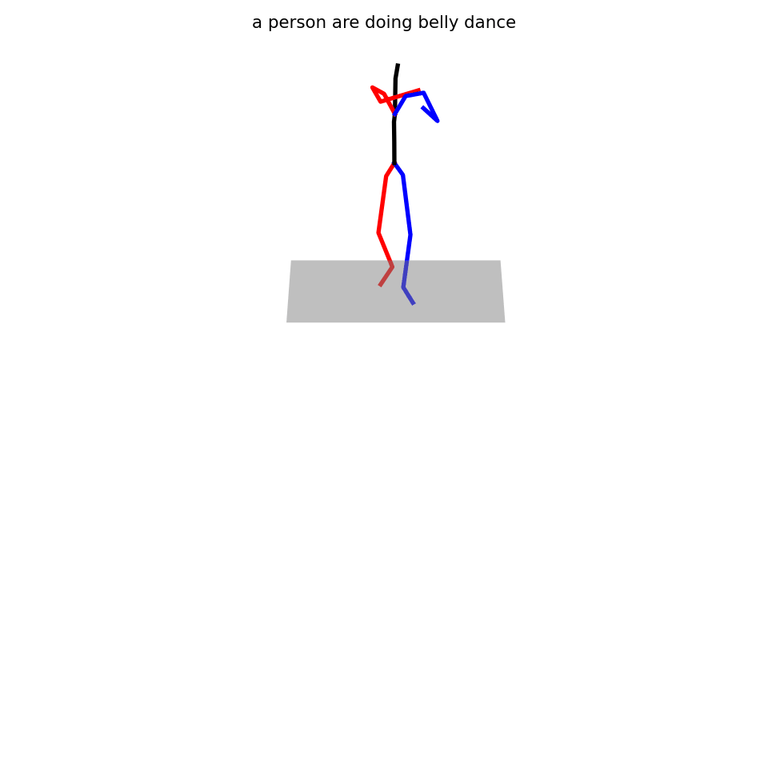
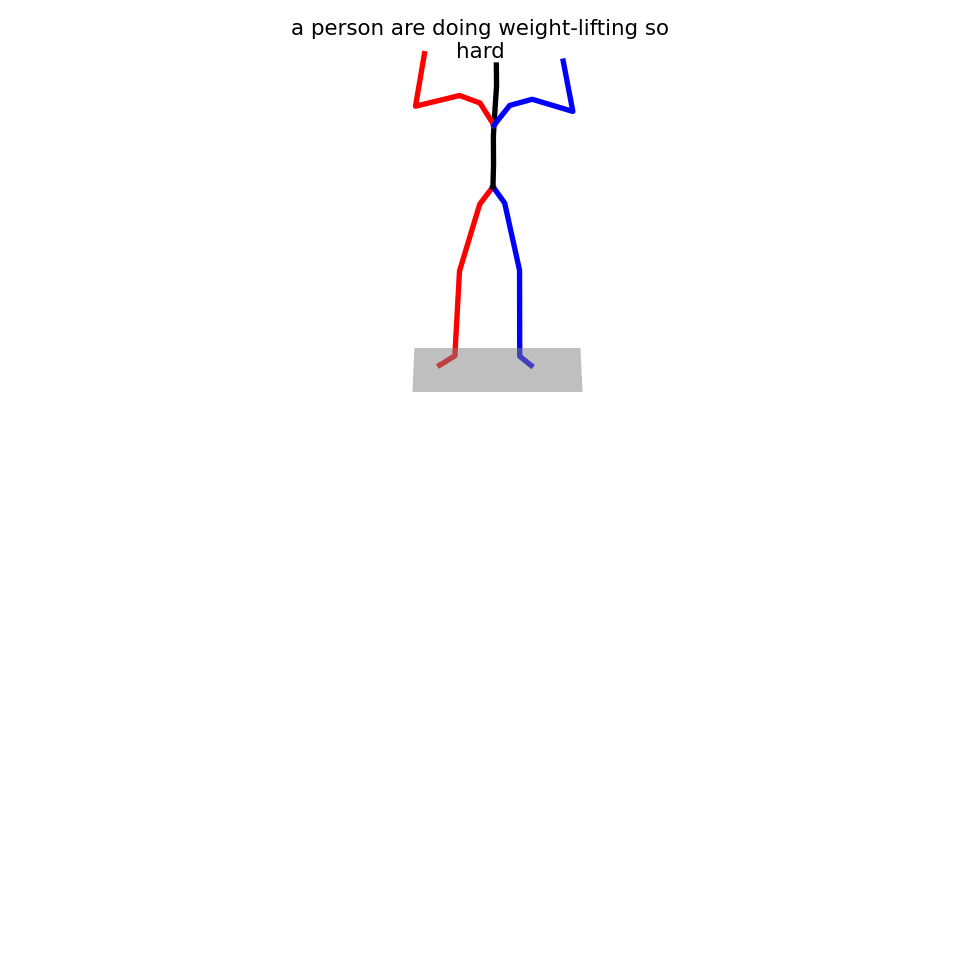
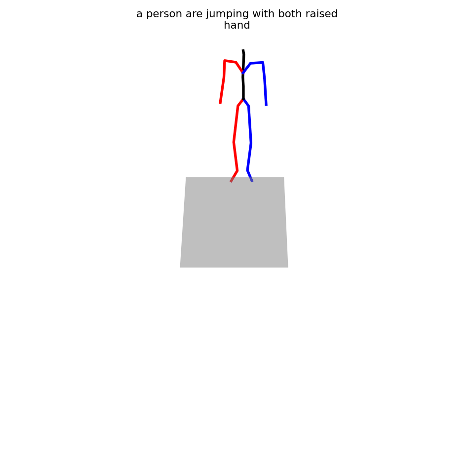
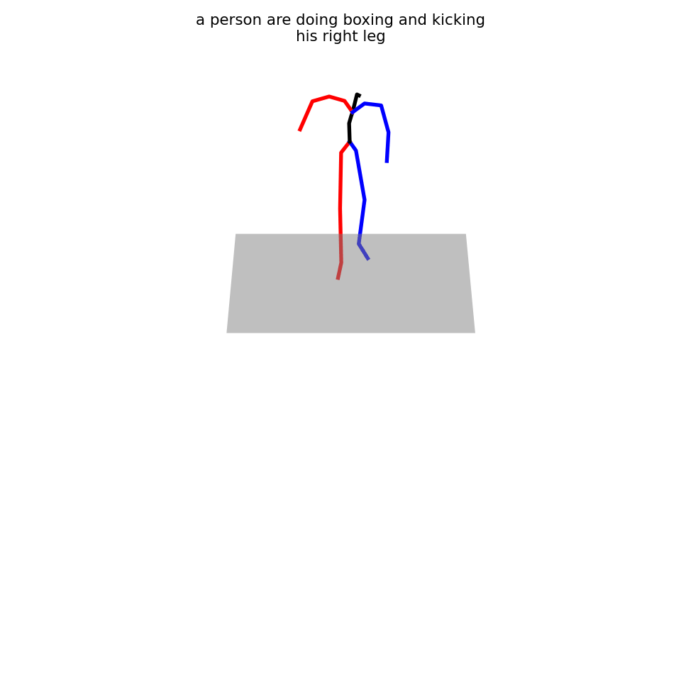
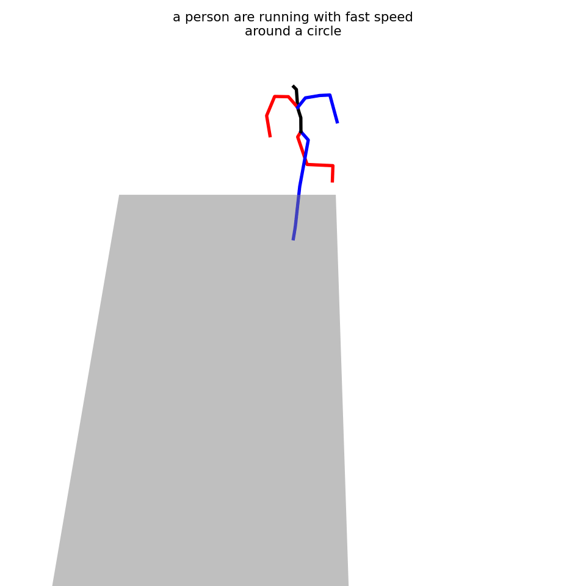
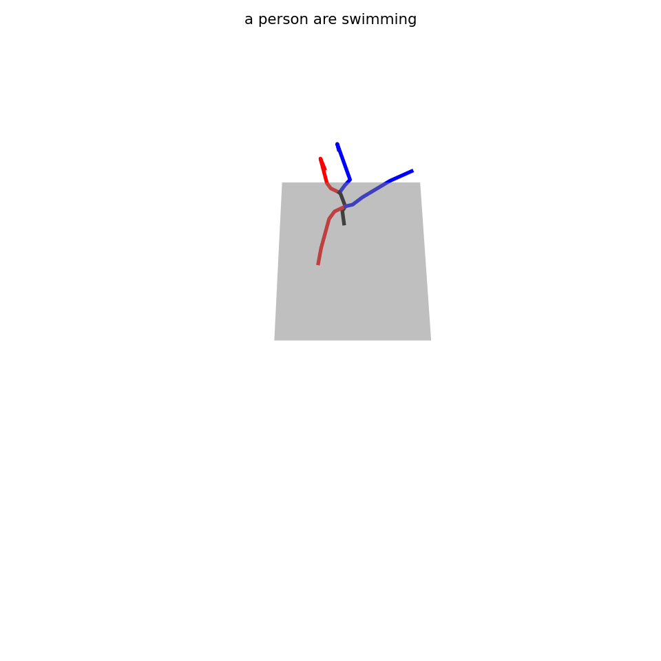

# Motion Diffusion Model


## Quick Demos
<table class="center">
    <tr>
    <td></td>
    <td></td>
    <td></td>
    </tr>
</table>
<table class="center">
    <tr>
    <td></td>
    <td></td>
    <td></td>
    </tr>
</table>

## Quick Start

This code was tested on `Ubuntu 18.04.5 LTS` and requires:

* Python 3.7
* conda3 or miniconda3
* CUDA capable GPU (one is enough)

### 1. Setup environment 

Install ffmpeg (if not already installed):

```shell
sudo apt update
sudo apt install ffmpeg
```
For windows use [this](https://www.geeksforgeeks.org/how-to-install-ffmpeg-on-windows/) instead.

Setup conda env:
```shell
conda env create -f environment.yml
conda activate mdm
python -m spacy download en_core_web_sm
pip install git+https://github.com/openai/CLIP.git
```

Download dependencies:

```bash
bash prepare/download_smpl_files.sh
bash prepare/download_glove.sh
bash prepare/download_t2m_evaluators.sh
```

### 2. Get data

**KIT** - Download from [HumanML3D](https://github.com/EricGuo5513/HumanML3D.git) (no processing needed this time) and the place result in `./dataset/KIT-ML`

## Train your own MDM

```shell
python -m train.train_mdm --save_dir save/mdm_output --dataset kit
```

## Train your own LGTT

```shell
python -m train.train_mdm --arch me --save_dir save/lgtt_output --dataset kit
```
## Train your own SinMDM

```shell
python -m train.train_mdm --arch unet --save_dir save/my_kit_unet_512 --dataset kit
```

## Evaluate

```shell
python -m eval.eval_humanml --model_path ./save/kit_trans_enc_512/model000400000.pt
```
