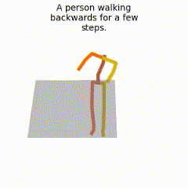
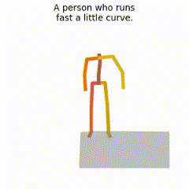
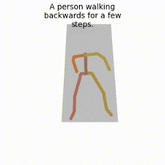
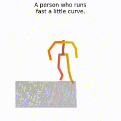

# Motion Diffusion Model


## Quick comparison to the base method MDM
### Quantitative evaluation
<div align="center">

| **Model**    |                  **R Precision ⬆️**                          ||        |          **Diversity ⬆️** |          **FID ⬇️**       |          **Download**       |
| ------------ | :-----------:        | :-----------:        | :-----------:         | :-----------:          | :-----------:          | :-----------:          |
|              |      Top 1           |     Top 2            |      Top 3            |                        |                        |                        |
|MDM           | $$0.3420^{\pm0066}$$ | $$0.5506^{\pm0055}$$ | $$0.6806^{\pm0038}$$  |  $$10.8756^{\pm0950}$$  |  $$1.5703^{\pm0658}$$  |  [🚀 Checkpoint](https://drive.google.com/file/d/1SHCRcE0es31vkJMLGf9dyLe7YsWj7pNL/view)  |
|*Ours          | $$0.3465^{\pm0059}$$ | $$0.5568^{\pm0072}$$ | $$0.6910^{\pm0067}$$  |  $$11.3812^{\pm1153}$$  |  $$0.9819^{\pm0406}$$  |  [🚀 Checkpoint](https://drive.google.com/file/d/1SHCRcE0es31vkJMLGf9dyLe7YsWj7pNL/view)  |

</div>


### Qualitative evaluation
<table class="center">
    <tr>
    <td>MDM</td>
    <td></td>
    <td></td>
    <td></td>
    <td></td>
    <td></td>
    </tr>
    <tr>
    <td>Ours</td>
    <td></td>
    <td></td>
    <td></td>
    <td></td>
    <td></td>
    </tr>
</table>
<!-- <hr style="border: 1px solid;"> -->

## Quick Start
A quick start guide of how to use our code is available in [demo.ipynb](https://colab.research.google.com/drive/13k2W21wlAKvPmMw6yp2ZCzuwtMmdu1ca?usp=sharing)

This code was tested on `Ubuntu 18.04.5 LTS` and requires:

* Python 3.7
* conda3 or miniconda3
* CUDA capable GPU (one is enough)

### 1. Setup environment 

Install ffmpeg (if not already installed):

```shell
sudo apt update
sudo apt install ffmpeg
```
For windows use [this](https://www.geeksforgeeks.org/how-to-install-ffmpeg-on-windows/) instead.

Setup conda env:
```shell
conda env create -f environment.yml
conda activate mdm
python -m spacy download en_core_web_sm
pip install git+https://github.com/openai/CLIP.git
```

Download dependencies:

```bash
bash prepare/download_smpl_files.sh
bash prepare/download_glove.sh
bash prepare/download_t2m_evaluators.sh
```

### 2. Get data

**KIT** - Download from [HumanML3D](https://github.com/EricGuo5513/HumanML3D.git) (no processing needed this time) and the place result in `./dataset/KIT-ML`

### 3. Train model
<details>
  <summary><b>Train your own MDM</b></summary>

```shell
python -m train.train_mdm --save_dir save/mdm_output --dataset kit
```
</details>

<details>
  <summary><b>Train your own LGTT</b></summary>
  
```shell
python -m train.train_mdm --arch me --save_dir save/lgtt_output --dataset kit
```
</details>

<details>
  <summary><b>Train your own SinMDM</b></summary>
  
```shell
python -m train.train_mdm --arch unet --save_dir save/my_kit_unet_512 --dataset kit
```
</details>


## Motion Synthesis
```shell
python -m sample.generate --model_path ./save/humanml_trans_enc_512/model000200000.pt --num_samples 10 --num_repetitions 3
```
## Evaluate

```shell
python -m eval.eval_humanml --model_path ./save/kit_trans_enc_512/model000400000.pt
```
